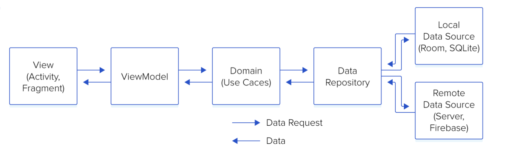

# PicSearch

Eng | Rus

## English

### Description

PicSearch is a pet project developed for educational purposes and practice. It is an Android application that enables users to search for images using the Unsplash API. Future updates will include integration with the Pinterest API. The app allows users to save image links to a local database for offline access. It features three main tabs:

- **Search:** Find images based on keywords.
- **Saved Images:** View images saved to the local database.
- **Settings:** Customize app preferences, including language (English or Russian), theme (light or dark), API source (Unsplash or Pinterest), and an option to delete all saved images.

### Status

PicSearch is currently under development. The core features are implemented, and future updates will include additional APIs and enhancements.

### Features

- Image search using keywords.
- Save image links to a local database.
- View saved images.
- Change app language (English/Russian).
- Switch between light and dark themes.
- Select API source (Unsplash/Pinterest).
- Delete all saved images.

### Tech Stack

- **Architecture:** MVVM
- **UI:** Jetpack Compose
- **Database:** Room
- **Networking:** Retrofit2
- **Image Loading:** Coil
- **Dependency Injection:** Koin

### Clean Architecture

The project adheres to the principles of Clean Architecture, with the code organized into three main modules:

- **app**: Contains the core application logic, including user interface components and dependency injection configuration.
    - `/di`: Dependency injection modules.
    - `/ui`: User interface modules.

- **data**: Responsible for data management, encompassing both remote and local data sources.
    - `/local`: Classes for local data storage.
        - `/dao`: Data Access Objects (DAOs) for database operations.
        - `/mapper`: Mappers for database classes.
        - `/model`: Database models.
    - `/remote`: Classes for interacting with remote data sources, such as the Unsplash API.
        - `/response`: Data classes representing API response structures.
    - `/repository`: Repository implementations that provide a single source of truth for data, combining remote and local sources.
        - `/utils`: Utility classes for data-related operations.
        - `/mapper`: Classes for mapping between data models (e.g., API responses to local entities or domain models).
- **domain**: Encapsulates the core business logic and use cases of the application.
    - `/models`: Data models representing business entities.
    - `/service`: Service interfaces.
        - `/service-name`:
            - `/repository`: Repository interfaces implemented in the data module.
            - `/usecase`: Use case classes that encapsulate specific business logic and interact with repositories.
    - `/utils`: Helper classes, including mappers and other utilities.

This modular structure ensures a clear separation of concerns, making the codebase more maintainable, testable, and scalable.

### License

This project is licensed under the MIT License. See the [LICENSE](LICENSE) file for details.

## Русский

### Описание

PicSearch — это пэт-проект, разработанный в образовательных целях и для практики. Это Android-приложение, позволяющее пользователям искать изображения с помощью API Unsplash. В будущих обновлениях планируется интеграция с API Pinterest. Приложение позволяет сохранять ссылки на изображения в локальной базе данных для доступа в автономном режиме. Оно имеет три основные вкладки:

- **Поиск:** Поиск изображений по ключевым словам.
- **Сохраненные изображения:** Просмотр изображений, сохраненных в локальной базе данных.
- **Настройки:** Настройка предпочтений приложения, включая язык (английский или русский), тему (светлая или темная), источник API (Unsplash или Pinterest) и опцию удаления всех сохраненных изображений.

### Статус

PicSearch находится в разработке. Основные функции реализованы, в будущих обновлениях будут добавлены дополнительные API и улучшения.

### Особенности

- Поиск изображений по ключевым словам.
- Сохранение ссылок на изображения в локальной базе данных.
- Просмотр сохраненных изображений.
- Изменение языка приложения (английский/русский).
- Переключение между светлой и темной темами.
- Выбор источника API (Unsplash/Pinterest).
- Удаление всех сохраненных изображений.

### Технологический стек

- **Архитектура:** MVVM
- **Пользовательский интерфейс:** Jetpack Compose
- **База данных:** Room
- **Сетевые запросы:** Retrofit2
- **Загрузка изображений:** Coil
- **Внедрение зависимостей:** Koin

### Чистая архитектура

Проект следует принципам Чистой архитектуры, с кодом, организованным в три основных модуля:

- **app**: Содержит основную логику приложения, включая компоненты пользовательского интерфейса и конфигурацию внедрения зависимостей.
    - `/di`: Модули внедрения зависимостей.
    - `/ui`: Модули пользовательского интерфейса.

- **data**: Отвечает за управление данными, включая как удаленные, так и локальные источники данных.
    - `/local`: Классы для локального хранения данных.
        - `/dao`: Объекты доступа к данным (DAO) для операций с базой данных.
        - `/mapper`: Мапперы классов бд.
        - `/model`: Модели бд.
    - `/remote`: Классы для взаимодействия с удаленными источниками данных, такими как API Unsplash.
        - `/response`: Классы данных, представляющие структуры ответов API.
    - `/repository`: Реализации репозиториев, которые предоставляют единый источник достоверных данных, объединяя удаленные и локальные источники.
        - `/utils`: Утилитарные классы для операций, связанных с данными.
        - `/mapper`: Классы для маппинга между моделями данных (например, ответы API на локальные сущности или доменные модели).
- **domain**: Инкапсулирует основную бизнес-логику и варианты использования приложения.
    - `/models`: Модели данных, представляющие бизнес-сущности.
    - `/service`: Интерфейсы сервисов.
        - `/service-name`
            - `/repository`: Интерфейсы репозиториев, которые реализуются в модуле data.
            - `/usecase`: Классы вариантов использования, которые инкапсулируют конкретную бизнес-логику и взаимодействуют с репозиториями.
    - `/utils`: Вспомогательные классы - мапперы и тд.

Эта модульная структура обеспечивает четкое разделение ответственности, делая кодовую базу более поддерживаемой, тестируемой и масштабируемой.

### Лицензия

Этот проект лицензирован под MIT License. Подробности см. в файле [LICENSE](LICENSE).